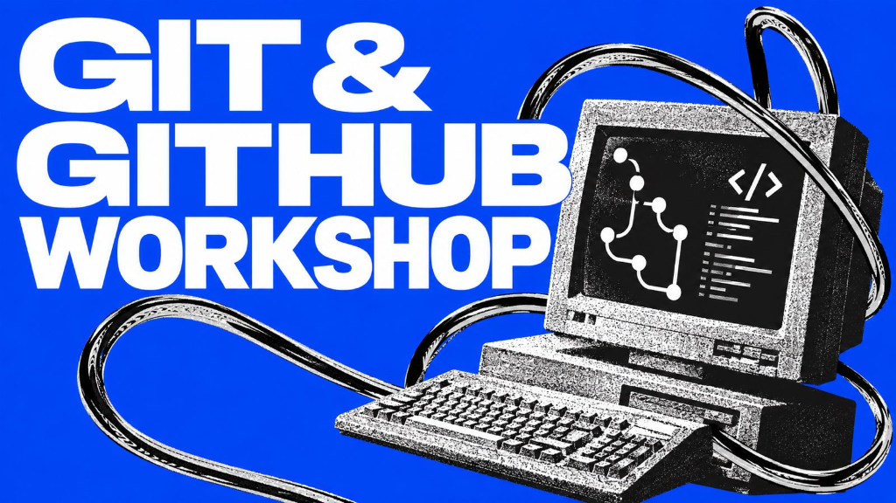

# 🎆 Fireworks Night

<p align="center">
  
</p>

An interactive web-based fireworks animation program built for the Git & GitHub Workshop.

## 👋 About This Project

**Created by:** `Nishant Mishra`  
**GitHub:** 'sirnishantm'

``

## ✨ Features

* Interactive fireworks canvas
* Click anywhere in the sky to launch fireworks
* Launch button to spawn fireworks at random positions
* Clear button to clear the sky and reset the counter
* Real-time counter tracking launched fireworks

## 🛠️ Technologies Used

* Python (Standard Library)
* HTML5
* CSS3
* JavaScript (Canvas API)

> 💡 **Note:** This project relies entirely on Python's built-in standard library (`webbrowser`, `tempfile`, `os`, `pathlib`). No external Python packages, Node.js, or package managers are required! You can replace `workshop-banner.png` with your own image to customize your repository banner.

## ▶️ How to Run

Make sure Python 3 is installed on your computer, then run:

```bash
python fireworks.py
```

Running this command will generate a temporary interactive webpage and automatically open it in your default web browser (works cross-platform on macOS and Windows).

## 📸 Preview

`[Add your screenshot here]`

## 🎨 My Changes

Describe the changes you made to the project here (e.g., replacing `workshop-banner.png` with your own banner, changing colors, or updating controls):

* `[Your change]`
* `[Your change]`
* `[Your change]`

## 👥 Contributors

Add yourself and any classmates or collaborators who worked with you on this project!

| Name | GitHub |
| --- | --- |
| `[Your Name]` | `[@your-username]` |
| `[Contributor Name]` | `[@username]` |

## 📚 GitHub Workshop

Use this starter project to practice key Git and GitHub concepts:

* Creating a repository
* Uploading files
* Making commits
* Editing files
* Creating branches
* Pushing changes
* Viewing commit history
* Adding contributors

## ⭐ What I Learned

`[Write what you learned during the workshop.]`
# Git_Github
